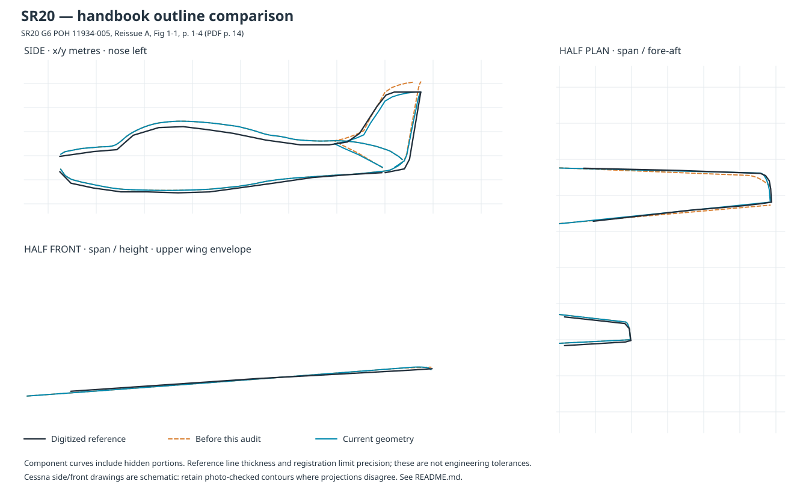
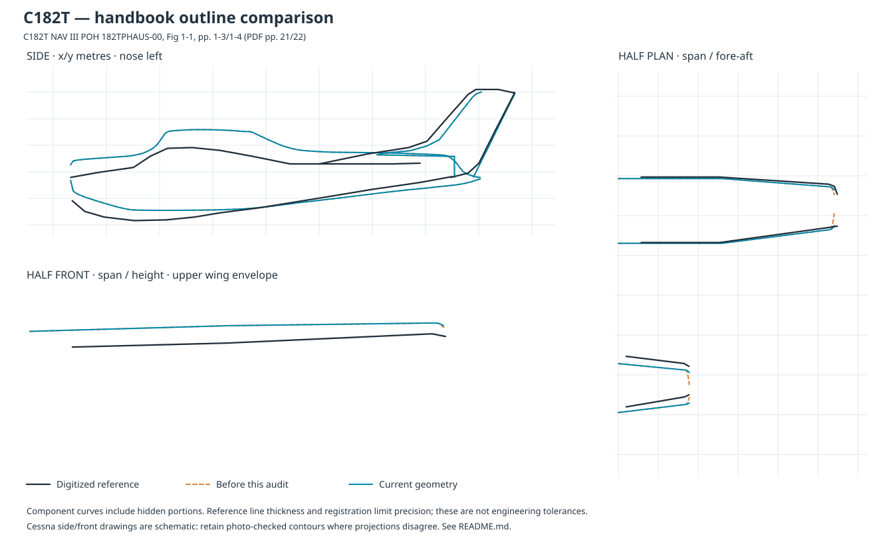
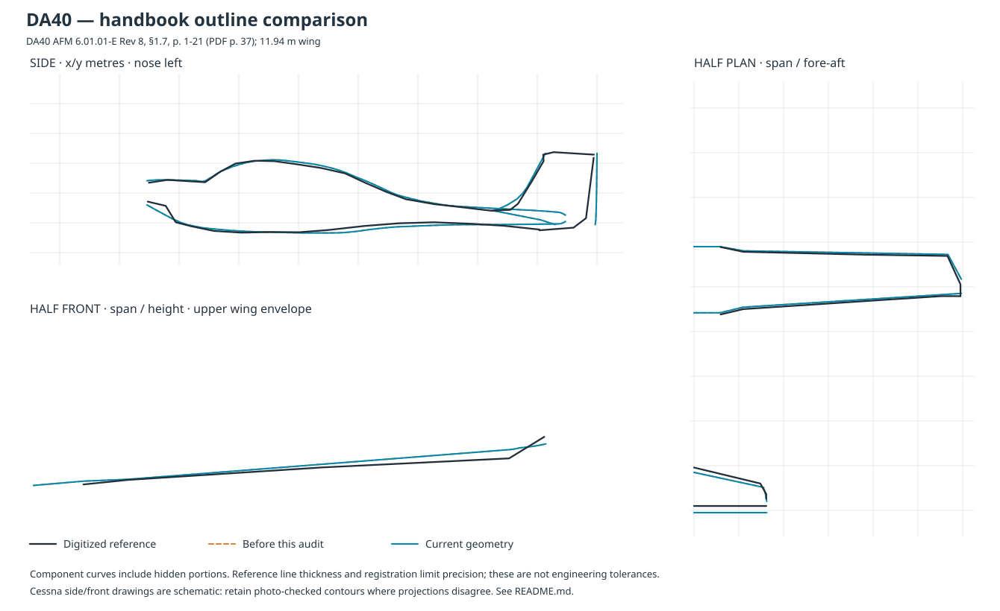

# Handbook outline traces

Detailed follow-up to the [photo audit](../GEOMETRY_AUDIT.md), October 8, 2026. These comparisons identify and correct specific outline errors in all four study models. They **do not establish that every surface is dimensionally exact**. The remaining discrepancies are shown, including ones that did not improve.

## References

Manufacturer-authored handbooks, accessed through these public mirrors:

| Aircraft           | Drawing and PDF page                                                                                                                                                 | Calibration                                                                                |
| ------------------ | -------------------------------------------------------------------------------------------------------------------------------------------------------------------- | ------------------------------------------------------------------------------------------ |
| SR20 G6            | [POH 11934-005, Reissue A](https://www.palomaraviation.com/pdf/sr20-g6-poh.pdf), Fig 1-1, printed 1-4, PDF 14                                                        | 26.0 ft length, 8.9 ft height, 11.67 m span                                                |
| C172S NAV III      | [POH 172SPHBUS-00](https://irp.cdn-website.com/295c38de/files/uploaded/C172S-G1000-POH.pdf), Fig 1-1, printed 1-3/1-4, PDF 11/12                                     | 27 ft 2 in length, 8 ft 11 in height, 36 ft 1 in span                                      |
| C182T NAV III      | [POH 182TPHAUS-00](https://www.dentoncap.org/uploads/182T-POH-Section-1-8.pdf), Fig 1-1, printed 1-3/1-4, PDF 21/22                                                  | 29 ft length, 9 ft 4 in height, 36 ft span                                                 |
| DA40, 11.94 m wing | [AFM 6.01.01-E, Rev 8](https://www.acbelleile.com/_files/ugd/ec5b88_820a629dca6a472ea7fe29b64398c055.pdf), §1.7, printed 1-21, PDF 37; dimensions/areas §1.4, PDF 22 | 8.007 m drawing length, 11.94 m span; side view de-rotated using its length dimension line |

The C182 handbook illustrates the KAP 140 variant. The C172 handbook illustrates NAV III/GFC 700. The DA40 reference has the conventional 11.94 m wing, not the different NG or long-wing silhouette.

The photo cross-check uses [N800KP's full-resolution side view](https://img1.wsimg.com/isteam/ip/b1e3e6d0-2bf2-4a64-93ca-a0c12c976249/IMG_1454.jpg), [N6189Q's front-quarter view](https://airport-data.com/aircraft/photo/000969995), the [current N8050J photo supplied by the user](https://flyingclub.org/images/50j-b.jpeg), a [C182T N775CP side view](https://airport-data.com/aircraft/photo/001504671), and [N949KC's side view](https://airport-data.com/aircraft/photo/001449965). They support checks of cabin/cowling shape, tailcone taper, fin proportions, struts and gear. They are perspective views, not calibrated orthographic measurements. Historical photographs and other registrations supply shape references only; they do not replace the four aircraft's approved paint schemes.

## Before / after comparisons

Black: manually digitized handbook outlines. Orange dashed: model at `3c6bd83dfa347f649cff3a82331bafc35069e923`, before this trace audit. Blue: current geometry. Each plot contains side, half-plan and half-front projections. Axes use metres, with the nose to the left in side view. Component curves include portions concealed by other components in a rendered aircraft.

### SR20 G6



- The fin previously used SR22/SR22T vertical stations, giving a fin-top height of 2.924 m above the modeled ground. The SR20 G6 POH specifies 8.9 ft (2.713 m). Rescale the fin, rudder, horn joint, hinge and attached trim/weight/wick details together; lower the NAV antenna to the new fin top, retaining longitudinal proportions. This is a height correction, not a claim that the older SR22 station table is an SR20 manufacturing drawing.
- The leading edge swept aft too much, and wingtip rounding began 0.64 m inboard. The drawing has an almost straight leading edge followed by a short curved end. Reduce the sweep and confine the tip curvature to the last 0.29 m; add mesh stations near its steep end.
- The mean reference-to-outline distances for the sampled wing leading/trailing edges improve from 0.076/0.043 m to 0.030/0.021 m under the recorded calibration. These are drawing-fit diagnostics, not real-aircraft tolerances.
- Retain the cabin and horizontal-tail tables: their general contours agree, but the cabin roof is still higher than the schematic trace. The side photo supports retaining its rounded crown. The fin root/tailcone junction and glazing remain approximations.

### C172S


- The previous rounded wing end retained only 45% of the nominal tip chord; the drawing shows a broad conical-camber cap. Preserve 85% at the end, with small corner rounding.
- The stabilizer/elevator tips also narrowed excessively (38% remaining chord). Preserve 90% and restrict the C172 corner rounding to the outer 3 inches. Both the fixed stabilizer and moving elevator use the shared corrected section functions.
- The traced final wing/tail chords are approximately 0.97/0.55 m; the corrected model sections are approximately 0.96/0.57 m. Comparing chord width removes the fore-aft registration offset that affects absolute edge residuals.
- Do not force the side-view fuselage or wing height to match this diagram: its cabin crown, belly and front-view wing height disagree with the photo-based station tables. The handbook also specifies a particular ground attitude/strut extension and includes tip lights in the span. Those differences remain visible and unresolved in the plots.

### C182T



- Apply the same broad Cessna wing and tail end caps using the 182's own dimensions. The final wing/tail chords change from approximately 0.47/0.32 m to 0.90/0.76 m, compared with about 0.80/0.71 m in the digitized drawing.
- Keep the source-backed straight/tapered wing panels and swept fin. The source shows a longer dorsal transition than the current model, and the side/front drawings disagree with the photo fit in cabin height and ground attitude. The horizontal tail also has a fore-aft registration discrepancy. These have **not** been resolved by this audit.
- The supplied N8050J front-quarter photograph and N775CP side photo support the existing rounded cowl, cabin shoulder and rising tailcone belly. Changing these to follow the schematic side projection would discard the prior photo fit without an adequately calibrated replacement.

### DA40



- The canopy, aft fuselage and wing planform are close to the drawing under the recorded calibration; retain their existing shape functions. The upper-fuselage sampled residual averages 0.023 m, with a 0.042 m maximum. That result is conditional on this registration, not a dimensional guarantee.
- Add the clipped leading corners at the horizontal-tail ends. The former tail was a simple trapezoid; §1.7 shows a distinct corner ahead of each elevator horn. Keep the trailing edge straight and preserve the elevator split. The final end chord is approximately 0.25 m versus 0.16 m in the trace; source registration and the coarse tip approximation remain visible.
- The resulting integrated horizontal-tail area is approximately 2.336 m², consistent with §1.4's 2.34 m². The front-view winglet height and aft fin/tailcone junction remain approximate.

## Method and reproducibility

1. Render the cited PDF pages at 144 dpi (2 pixels per PDF point). `handbook-traces.json` records the original pixel picks and the source URL/page for every model. Pixel origin is the top-left of the rendered page.
2. Calibrate with the printed dimensions and identifiable anchors. Side views use spinner-tip/ground anchors for SR20/Cessnas; their horizontal and vertical scales are independent. Plan views use spinner tips and span. Front views use propeller hubs and span. The DA40 rotated side view uses an affine basis aligned to its dimension line. Every transform is recorded as `pixelOrigin`, `worldOrigin`, `u`, `v`: `world = worldOrigin + u * pixelDx + v * pixelDy`.
3. Pick visible upper/lower fuselage contours, fin edges, wing/tail planform edges and upper wing front outlines. Include rounded tip caps in the edge picks. Occluded details, gear, spinner, glazing, individual airfoil sections and small fittings are outside these numeric traces; inspect them in the photos and assembled browser views.
4. Sample the same exported geometry functions used by the model. Include all fin stations so narrow dorsal transitions are not skipped. Front curves use the maximum height of each airfoil section. These are component projections, not screenshots or a photogrammetric reconstruction.
5. `measurements.json` records distances in metres from each digitized point to the sampled model polyline, before and after. Fin/wing/tail edge points use the complete component perimeter including end caps. Means are unweighted over manually selected points; maxima expose mismatches. The sampling is sparse and nonuniform. Do not interpret these numbers as an overall accuracy score or use them to conceal source disagreements. For example, the C182 tail registration discrepancy persists after correcting its tip width, and the DA40 chamfer is better assessed by tip chord than nearest-perimeter distance.

Run with Node 22.15+ and installed project dependencies:

```sh
npm run trace
# Only to reproduce the recorded baseline:
npm run trace -- --baseline 3c6bd83dfa347f649cff3a82331bafc35069e923
```

The script uses the installed TypeScript compiler and local geometry sources; it needs no network, drawing download or new dependency. It regenerates the SVGs and measurement JSON. Baseline capture reads the stated commit through Git without changing the working tree.

## Verification and remaining limits

`tests/handbook-outlines.test.ts` measures the **assembled meshes**, including movable elevator sections, against the traced Cessna/DA40 end-cap widths on both sides. It also checks the SR20 outer-wing contour and DA40 tail area. `tests/sr20-fin-rudder.test.ts` checks the SR20's handbook height and moving horn geometry. Existing cowl tests continue to verify genuine openings through the skin.

Inspect all four models in side, front, top and quarter browser views, switch solid ↔ x-ray, and operate the controls. Use `npm run shot -- sr20/overview c172s/overview c182t/overview da40/overview --solid --no-labels` for the standard saved views. The browser check complements the numeric traces: it catches separated fixed/moving sections and paint or detail placement problems that scalar dimensions cannot.

The major supported corrections are implemented; source conflicts are recorded above. Exact fuselage cross-sections, wing twist, compound tip surfaces and model-specific manufacturing stations would require better engineering drawings or calibrated scans. The current models remain instructional approximations.
