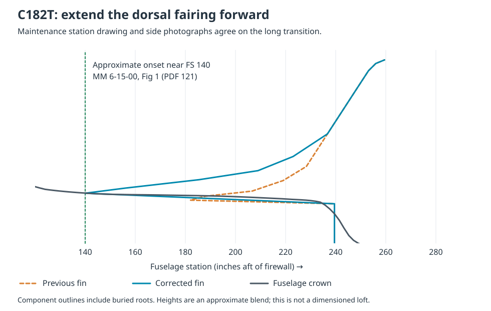

# Resolving the Cessna reference discrepancy

Follow-up evidence reviewed October 8, 2026. **The new evidence supports a longer C182 dorsal fairing; it does not support the earlier suggestion that the photographs disprove the drawings.** There were two separate problems: a short model fairing and incorrectly registered comparison drawings.

## Evidence and decisions

| Region                                           | Additional evidence                                                                                                                         | Finding and action                                                                                                                                                                                                                                                                                                                                                                                                           |
| ------------------------------------------------ | ------------------------------------------------------------------------------------------------------------------------------------------- | ---------------------------------------------------------------------------------------------------------------------------------------------------------------------------------------------------------------------------------------------------------------------------------------------------------------------------------------------------------------------------------------------------------------------------- |
| C182 upper tailcone into the fin                 | Cessna 182/T182 maintenance manual, **6-15-00, Fig 1, sheet 1, printed page 2, April 1/2002 (PDF 121)**; N775CP and PH-PBW side photographs | The station illustration puts the start of the dorsal fairing near **FS 140**, ahead of FS 156. Both photos show a long, shallow transition behind the rear glazing. The old table began at FS 182, with much of that portion hidden inside the fuselage. Extend the fairing forward and include all its profile breaks in the actual shell mesh. The model error is resolved; the drawing and photos agree on this feature. |
| C172/C182 cabin crown and belly                  | Manufacturer POH Fig 1-1 dimensions, propeller clearance notes, and independently reviewed maintenance three-views                          | The earlier side-view transforms used independent horizontal/vertical scales and a ground anchor. They misplaced the drawn propeller hubs relative to model y = 0. Re-register both side views to the hub with a uniform length scale. The revised plots no longer contain that artificial translation/stretch. Remaining differences cannot be called measured aircraft errors.                                             |
| Cessna apparent wing/cabin height in photographs | N6242F C172S head-on view, N793SP side/front-quarter views, and C182 front views from two aircraft listings                                 | Camera elevation, pitch and depth separation change where the wing projects relative to the hub. A low camera can put the wing near or below the hub in the image. These are useful qualitative checks, but they cannot establish a replacement roof/wing height in metres. Retain those approximate model dimensions rather than declare either schematic or photograph metrically authoritative.                           |

## Sources inspected

- [Cessna 182/T182 maintenance manual, 1997 and on](https://www.aeroelectric.com/Reference_Docs/Cessna/cessna-maintenance-manuals/Cessna_182S_1997on_MM_182SMM.pdf): station drawing **PDF 121**, front/side three-view **PDF 119**. The station drawing explicitly labels FS 124, 140, 156, 185.50 and 209. It is an installation/station illustration, **not a dimensioned surface loft**. FS 140 is an approximate graphical onset, not a published fairing part dimension.
- [Cessna 172 maintenance manual, 1996 and on](https://mxdocs.thrustinstitute.com/wp-content/uploads/2025/06/240903411-Cessna-172-Maintenance-Manual_unlocked-compressed.pdf): three-view **PDF 110**, fuselage stations **PDF 112**, dated April 7/2003. These are additional manufacturer illustrations, not independent physical measurements.
- [N775CP, 2006 C182T, airborne side photograph](<https://commons.wikimedia.org/wiki/File:N775CP_2006_Cessna_182T_Skylane_C-N_18281779_Civil_Air_Patrol_(5514346344).jpg>), Tomás Del Coro, CC BY-SA 2.0. The long-lens view shows the dorsal transition clearly; the low viewing angle and wing obscure the cabin crown.
- [PH-PBW, Cessna 182T, ground side photograph](https://commons.wikimedia.org/wiki/File:Cessna_182T_Skylane_AN2070482.jpg), André Wadman. Independently confirms the long dorsal transition. Used qualitatively; the catalogue metadata is not a dimensional reference.
- [N793SP C172S side profile](https://commons.wikimedia.org/wiki/File:2001_N793SP_Cessna_172S_Skyhawk_Side_Profile_at_Doylestown_Airport,_Pennsylvania.jpg) and [front-quarter view](https://commons.wikimedia.org/wiki/File:2001_N793SP_Cessna_172S_Skyhawk_Front_View_at_Doylestown_Airport,_Pennsylvania.jpg), DYLspotter, CC0. Despite the latter's filename, it is not a straight-on orthographic view.
- [N6242F, 2008 C172S listing](https://www.hangar67.com/aircraft/2008-cessna-172s-skyhawk/37430), including its [head-on photograph](https://www.hangar67.com/photos/37430/0a4e78a612.jpg).
- [2004 C182T listing](https://aircraftexchange.com/jet-aircraft-for-sale/details/9309/2004-cessna-182t-skylane) and [N182SK, 2023 C182T listing](https://www.flyhpa.com/aircraft/n182sk-2023-cessna-182t-skylane/): front-view camera-angle checks only. The newer aircraft does not establish N8050J's equipment or paint.

The photos are linked rather than redistributed in the application. N8050J's supplied current red/white photograph remains the paint reference.

## What was wrong with the comparison

Coordinates below are pixels on the POH pages rendered at 144 dpi, as in `handbook-traces.json`. Hub centres and drawing extents are manual picks, uncertain by a few pixels.

| Check                                     | C172S, PDF 12                 | C182T, PDF 22                 |
| ----------------------------------------- | ----------------------------- | ----------------------------- |
| Approximate propeller hub                 | (151, 423)                    | (300, 332)                    |
| Previous transform's hub y                | **+0.298 m**                  | **−0.305 m**                  |
| Model hub y / corrected reference hub y   | 0 / 0 m                       | 0 / 0 m                       |
| Uniform drawing scale from overall length | 0.011115 m/pixel              | 0.014562 m/pixel              |
| Drawn maximum height at that scale        | about **2.40 m** (216 pixels) | about **3.12 m** (214 pixels) |
| Printed maximum height                    | **2.718 m** (8 ft 11 in)      | **2.845 m** (9 ft 4 in)       |

These differences exceed a few pixels of line-picking uncertainty. Matching both printed length and height requires stretching the illustration, and still does not guarantee agreement with the hub/ground-clearance landmarks. A maximum-height label and a normal-ground-attitude illustration also need not describe exactly the same loading/strut condition. The drawings therefore cannot provide a unique, exact fuselage loft just by scaling their page outlines.

The revised comparison preserves each side illustration's aspect ratio, scales it using overall length, and aligns the hub vertically. It **does not infer aircraft pitch or a manufacturing datum** from the stabilizer chord, paint stripe, or ground line. It remains a schematic comparison, not photogrammetry.

A new reproducibility check also caught reversed basis signs in the **SR20 top** and **DA40 side** calibration metadata. Their stored points and plots were already oriented correctly; fix the metadata to reproduce those points. `superseded-calibrations.json` preserves all replaced transforms. Both before/after geometry curves now use the same corrected reference; old and new residual numbers must not be compared across calibration revisions.

## Geometry change and limits

The forward onset changes from the old table's FS 182 to approximately FS 140. Intermediate heights blend into the existing fin at h = 85 inches, retaining the upper fin and rudder hinge. **Those intermediate heights are approximate modeling choices, not maintenance-manual waterlines.** Including each station in the shell is essential: modifying only the mathematical profile while omitting the shallow stations from mesh tessellation would leave the fairing clipped off.

The regression test measures the assembled vertical-stabilizer shell and requires exposed fairing geometry ahead of FS 165. Another test reconstructs every recorded reference point from its pixel picks and affine transform. Standard geometry, inlet and moving-surface checks still apply.

The discrepancy is resolved as **a real dorsal-fairing model error plus a reference-registration error**, not an established conflict between real aircraft and manufacturer drawings. Exact cabin cross-sections, door-opening geometry, wing incidence and ground-attitude alignment remain approximate; this evidence does not certify them.

## Verification

`npm run check` passes formatting, TypeScript and **198 tests**; `npm run build` passes. Inspected the solid overview, both side views, quarter/top views and generated plots. A browser check confirmed the C182 returns to x-ray materials and its textured rudder responds to the yaw control after the fairing change.
